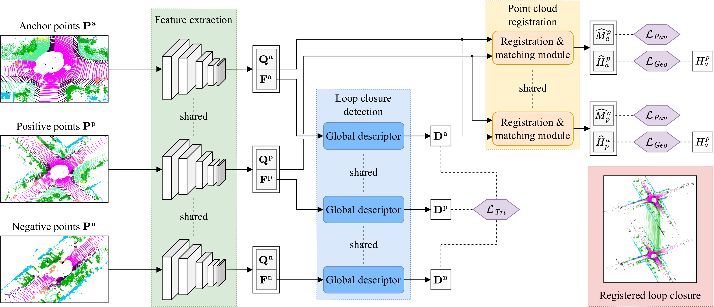

# PADLoC
[**arXiv**](https://arxiv.org/abs/2209.09699) | [**IEEE Xplore**](https://ieeexplore.ieee.org/document/10024875) | [**Website**](http://padloc.cs.uni-freiburg.de/) | [**Video**](https://www.youtube.com/watch?v=o_pHmXuUjg0)

This repository is the official implementation of the paper:

> **PADLoC: LiDAR-Based Deep Loop Closure Detection and Registration using Panoptic Attention**
>
> [José Arce](https://rl.uni-freiburg.de/people/arceyd), [Niclas Vödisch](https://vniclas.github.io/), [Daniele Cattaneo](https://rl.uni-freiburg.de/people/cattaneo), [Wolfram Burgard](http://www2.informatik.uni-freiburg.de/~burgard/), and [Abhinav Valada](https://rl.uni-freiburg.de/people/valada).
>
> *IEEE Robotics and Automation Letters (RA-L)*, vol. 8, issue 3, pp. 1319-1326, March 2023

<p align="center">
  
</p>

If you find our work useful, please consider citing our paper:
```
@article{arce2022padloc,
  author={Arce, Jos{\'e}, and V{\"o}disch, Niclas and Cattaneo, Daniele and Burgard, Wolfram and Valada, Abhinav},
  journal={IEEE Robotics and Automation Letters},
  title={PADLoC: LiDAR-Based Deep Loop Closure Detection and Registration Using Panoptic Attention},
  year={2023},
  volume={8},
  number={3},
  pages={1319-1326}
}
```


## 📔 Abstract

A key component of graph-based SLAM systems is the ability to detect loop closures in a trajectory to reduce the drift accumulated over time from the odometry. Most LiDAR-based methods achieve this goal by using only the geometric information, disregarding the semantics of the scene. In this work, we introduce PADLoC, a LiDAR-based loop closure detection and registration architecture comprising a shared 3D convolutional feature extraction backbone, a global descriptor head for loop closure detection, and a novel transformer-based head for point cloud matching and registration. We present multiple methods for estimating the point-wise matching confidence based on diversity indices. Additionally, to improve forward-backward consistency, we propose the use of two shared matching and registration heads with their source and target inputs swapped by exploiting that the estimated relative transformations must be inverse of each other. Furthermore, we leverage panoptic information during training in the form of a novel loss function that reframes the matching problem as a classification task in the case of the semantic labels and as a graph connectivity assignment for the instance labels. We perform extensive evaluations of PADLoC on multiple real-world datasets demonstrating that it achieves state-of-the-art performance.


## 👨‍💻 Code Usage

Please check the documentation files for the specific tasks of:
* [Requirements and Installation](docs/install.md)
* [Datasets and preprocessing](docs/preproc.md)
* [Training a model](docs/training.md)
* [Evaluating a model](docs/eval.md)


## 👩‍⚖️  License

For academic usage, the code is released under the [GPLv3](https://www.gnu.org/licenses/gpl-3.0.en.html) license.
For any commercial purpose, please contact the authors.


## 🙏 Acknowledgment

This work was funded by the European Union’s Horizon 2020 research and innovation program under grant agreement No 871449-OpenDR and the DFG
Emmy Noether Program.
<br><br>
<a href="https://opendr.eu/"></a>
